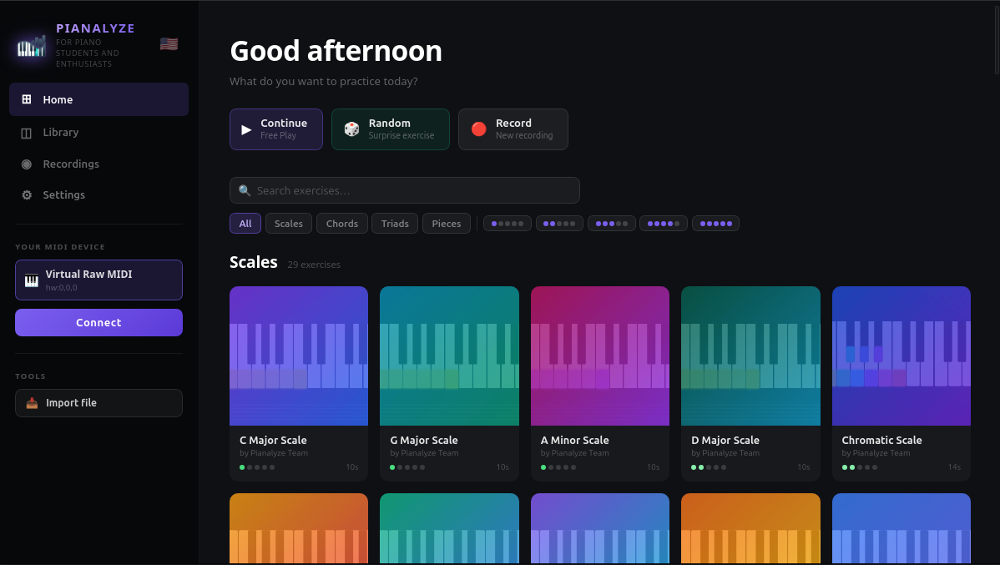

<p align="center">
  
</p>

<h1 align="center">Pianalyze</h1>

<p align="center">
  <strong>A cross-platform desktop piano learning app powered by real-time MIDI analysis.</strong><br/>
  Connect your keyboard, practice pieces, and get instant feedback — all in one native app.
</p>

<p align="center">
  
  
  
  
  
</p>

---

## ✨ Screenshots

> 📸 _Screenshots coming soon — add yours here!_
>
> To contribute screenshots, place images in `docs/screenshots/` and reference them below.

<!-- Uncomment and replace the paths once you have screenshots:

<p align="center">
  
</p>
<p align="center">
  
</p>
<p align="center">
  
</p>

-->

---

## 📦 Download & Install

Pre-built binaries are available on the [**Releases page**](https://github.com/leandrodaf/pianalyze/releases/latest). No Go or Node.js required — just download and run.

---

### 🍎 macOS

> ⚠️ **Important — unsigned binary:** Pianalyze is not signed with an Apple Developer certificate (the program costs ~$99/year). Because of this, macOS **Gatekeeper will block the app** the first time you try to open it, showing a warning like *"cannot be opened because the developer cannot be verified"*.  
> This is expected — **the app is safe**. Follow the steps below to run it anyway.

#### Which file to download?

| Your Mac | Chip | File to download |
|---|---|---|
| MacBook / iMac / Mac Mini **M1, M2, M3, M4** | Apple Silicon | `pianalyze_*_darwin-arm64.tar.gz` |
| MacBook / iMac **2020 or older (Intel)** | Intel x86_64 | ⚠️ Sem binário pré-compilado — veja abaixo |

> Not sure which chip you have? Click the Apple menu → **About This Mac** and look for "Apple M…" (Silicon) or "Intel" in the chip/processor line.

#### Steps to install (Apple Silicon)

```bash
# 1. Extract the archive
tar -xzf pianalyze_*_darwin-arm64.tar.gz

# 2. Remove the quarantine flag macOS adds to downloaded files
xattr -rd com.apple.quarantine ./pianalyze

# 3. Run
./pianalyze
```

**Alternative (no terminal):** Right-click the app → **Open** → click **Open** again in the dialog. macOS will remember the exception going forward.

If you see *"Apple could not verify…"* in System Settings: go to **System Settings → Privacy & Security**, scroll down, and click **"Open Anyway"** next to pianalyze.

---

#### 🖥️ macOS Intel (build from source)

Não há binário pré-compilado para Macs com processador Intel. Você precisa compilar o app localmente — o processo é simples:

**1. Instale as dependências:**
- [Go 1.26+](https://go.dev/dl/) — escolha o instalador macOS (Intel/amd64)
- [Node.js 18+](https://nodejs.org/)
- [Wails CLI](https://wails.io/docs/gettingstarted/installation):
  ```bash
  go install github.com/wailsapp/wails/v2/cmd/wails@latest
  ```

**2. Clone e compile:**
```bash
git clone https://github.com/leandrodaf/pianalyze.git
cd pianalyze
wails build
```

**3. O binário estará em `build/bin/pianalyze` — execute:**
```bash
open build/bin/pianalyze.app
```

> O primeiro build pode demorar alguns minutos enquanto baixa as dependências.

---

### 🪟 Windows

Download `pianalyze_*_windows-amd64.zip`, extract it, and run `pianalyze.exe`.

> Windows SmartScreen may show a warning on first run. Click **"More info" → "Run anyway"**.

---

### 🐧 Linux

**Debian / Ubuntu (recommended):**
```bash
sudo dpkg -i pianalyze_*_amd64.deb
pianalyze
```

**Other distributions (tar.gz):**
```bash
tar -xzf pianalyze_*_linux-amd64.tar.gz
./pianalyze
```

> Linux requires `libgtk-3`, `libwebkit2gtk-4.1`, and `libasound2` at runtime:
> ```bash
> sudo apt install libgtk-3-0 libwebkit2gtk-4.1-0 libasound2
> ```

---

## 🎹 What is Pianalyze?

Pianalyze is a native desktop application that bridges your MIDI keyboard and your computer to make piano practice smarter. It captures every note you play, analyses it in real time, and guides you through a growing library of exercises and pieces.

Built with **Go** (backend + MIDI pipeline) and **Svelte/TypeScript** (frontend), packaged as a single native binary via **[Wails](https://wails.io)**.

---

## 🚀 Features

### 🎵 Real-Time MIDI Analysis
- Connects to any MIDI device on macOS, Windows, and Linux
- Identifies the pressed note, chord name, inversion, and musical dynamic (pp → ff) on every key press
- Pipeline processes events in < 30 µs with zero allocations for chord detection

### 🌊 Note Waterfall
- Falling-note display à la Synthesia — coloured by hand (left/right) and finger
- Live grading overlay: **Perfect** / **Good** / **OK** per note, with timing delta feedback

### 📖 Exercise & Piece Library
- Built-in exercises covering scales, chords, triads, and classical/popular pieces
- Filter and search by category, difficulty (1–5), and name
- Import any **MusicXML** (`.xml` / `.mxl`) or `.pia` file to practice your own scores

### 📝 MusicXML Import
- Full converter supporting: tempo maps, time and key signatures, hairpins, fermatas, fingering, articulations, slurs, pedal events, repeats, rehearsal marks, and grace notes
- Imported scores include per-note fingering hints displayed on the falling waterfall

### 🏆 Practice Grading
- Server-side grader written in Go for nanosecond timing precision
- Configurable tolerance windows (early/late/perfect/good) via grading profiles
- Optional velocity / dynamic checking — play at the right volume to score **Perfect**
- Chord completion tracking — shows how many notes of a chord you hit simultaneously

### 🎙️ Performance Recording
- Record your free-play sessions to `.pia` format
- Playback with adjustable speed, looping, and section markers

### 🌍 Internationalization
- UI available in **English**, **Portuguese (Brazil)**, **Spanish**, and **Chinese (Simplified)**

---

## 🏗️ Architecture

```
MIDI Device
    │
    ▼
MIDI Client (github.com/leandrodaf/midi/v2)
    │
    ▼
Event Pipeline ──────────────────────────────────────────────────┐
  NoteStateUpdaterStage   → pressed notes snapshot, velocity, dynamic
  IntervalCalculatorStage → µs since previous event
  NoteIdentifierStage     → note name (e.g. "C3")
  ChordIdentifierStage    → chord name, inversion, triad flag
  FinalStage              → emit MIDIState to Wails frontend
    │
    ▼
Wails Runtime ──► Svelte Frontend
  Piano.svelte            keyboard visualisation
  NoteWaterfall.svelte    falling notes + grading overlay
  Timeline.svelte         playback & speed controls
  ChordPanel.svelte       real-time chord readout
  HomeScreen.svelte       device picker + library/recordings nav
```

### Key packages

| Package | Responsibility |
|---|---|
| `internal/pipeline/` | Generic `Stage[TContext, TState]` interface + `Processor` |
| `internal/pipeline/stages/` | Five concrete pipeline stages |
| `internal/midi/` | 128-note map, 80+ chord types (bitmask lookup ~20 ns), velocity→dynamic |
| `internal/grading/` | Concurrent grader — binary-search timing, hold-fraction, chord completion |
| `musicxml.go` | MusicXML → `.pia v2` converter |
| `frontend/src/` | Svelte/TypeScript UI, canvas-based waterfall and piano |

---

## 🛠️ Getting Started

### Prerequisites

| Requirement | Version |
|---|---|
| [Go](https://go.dev/dl/) | 1.26+ |
| [Node.js](https://nodejs.org/) | 18+ |
| [Wails CLI](https://wails.io/docs/gettingstarted/installation) | v2 |

**Linux (Ubuntu/Debian) — additional system libs:**
```bash
sudo apt install libgtk-3-dev libwebkit2gtk-4.1-dev libasound2-dev
```

### Clone & run

```bash
git clone https://github.com/leandrodaf/pianalyze.git
cd pianalyze

# Hot-reload dev mode (frontend + backend)
wails dev -tags webkit2_41
```

### Build a release binary

```bash
wails build -tags webkit2_41
# Output: build/bin/pianalyze
```

### Environment

| Variable | Values | Effect |
|---|---|---|
| `BUILD_MODE` | `production` | Structured JSON logging via Zap |
| _(unset)_ | | Human-readable development logging |

---

## 🧪 Development

```bash
# Run all tests (with race detector)
go test -race -tags webkit2_41 ./...

# Run a specific package
go test -race ./internal/midi/

# Benchmarks
go test -bench=. -benchmem ./internal/midi/

# Lint
golangci-lint run --build-tags webkit2_41 ./...

# TypeScript type-check
cd frontend && npx tsc --noEmit

# Frontend unit tests
cd frontend && npm test
```

### Import a batch of MusicXML files (tool test)

```bash
CONVERT_INPUT=~/my-scores CONVERT_OUTPUT=~/pia-files \
  go test -tags "tools webkit2_41" -run TestBatchConvert -v . -timeout 300s
```

### Folder structure

```
cmd/                    Wails app entry + MIDI device setup
internal/
  constants/            Shared string constants & sentinel errors
  grading/              Concurrent timing grader
  midi/                 Note names, chord table, velocity→dynamic
  pipeline/             Generic stage pipeline
    pipelinectx/        PipelineContext (event + accumulated analysis)
    stages/             Five concrete stage implementations
    store/              Mutex-protected pressed-notes state
frontend/src/
  components/           Svelte UI components
  lib/                  Canvas renderers, music theory utils, i18n
  stores/               Svelte stores (midi, playback, settings…)
docs/                   Architecture design documents
data/                   Built-in exercise definitions
```

---

## 🤝 Contributing

Contributions are welcome!

1. Fork the repository
2. Create a feature branch: `git checkout -b feature/my-feature`
3. Commit your changes following [Conventional Commits](https://www.conventionalcommits.org/)
4. Push and open a Pull Request

Please make sure `go test -race -tags webkit2_41 ./...` and `golangci-lint run --build-tags webkit2_41 ./...` pass before submitting.

---

## 🗺️ Roadmap

- [ ] Multi-part scores (left/right hand isolation, play-along accompaniment)
- [ ] Performance history and progress charts
- [ ] Rhythm accuracy and timing metrics dashboard
- [ ] Expanded built-in piece library

---

## 🇧🇷 Em Português

**Pianalyze** é um aplicativo de desktop **gratuito e open-source** para quem quer **aprender piano** ou melhorar a prática.

### O que o app faz

- Conecta ao seu teclado MIDI e analisa cada nota em tempo real
- Mostra as notas caindo na tela (como o Synthesia) enquanto você toca
- Detecta acordes, inversões e dinâmicas musicais (pp → ff) automaticamente
- Avalia seu timing nota por nota: **Perfeito / Bom / OK**
- Importa partituras no formato **MusicXML** (exportado pelo MuseScore, Sibelius, Finale, etc.)
- Biblioteca de exercícios integrada: escalas, acordes, tríades e peças

### Para quem é

- Iniciantes que querem **aprender piano do zero** com orientação visual
- Alunos que desejam **praticar peças** com feedback de timing preciso
- Pianistas que querem analisar sua **dinâmica e digitação** em tempo real

### Como instalar

```bash
git clone https://github.com/leandrodaf/pianalyze.git
cd pianalyze
wails dev -tags webkit2_41
```

> Funciona em **macOS**, **Windows** e **Linux**. Compatível com qualquer teclado MIDI USB.

---

## 📄 License

This project is licensed under the [MIT License](LICENSE).

